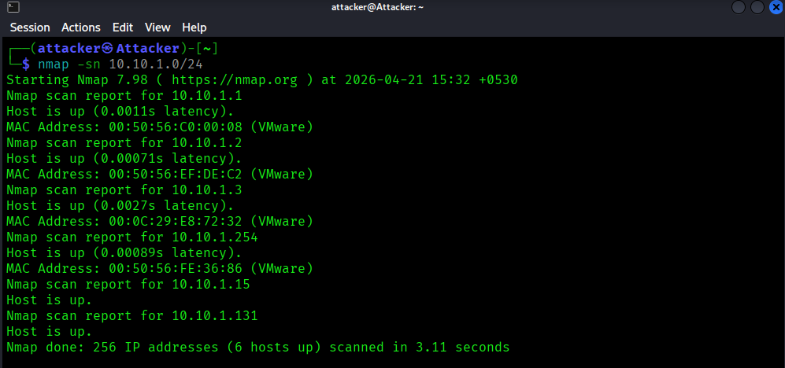
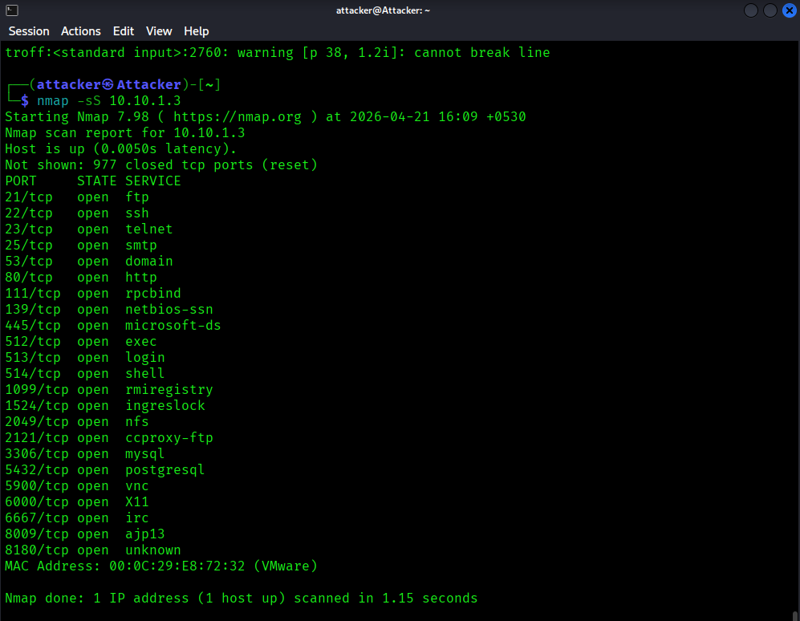
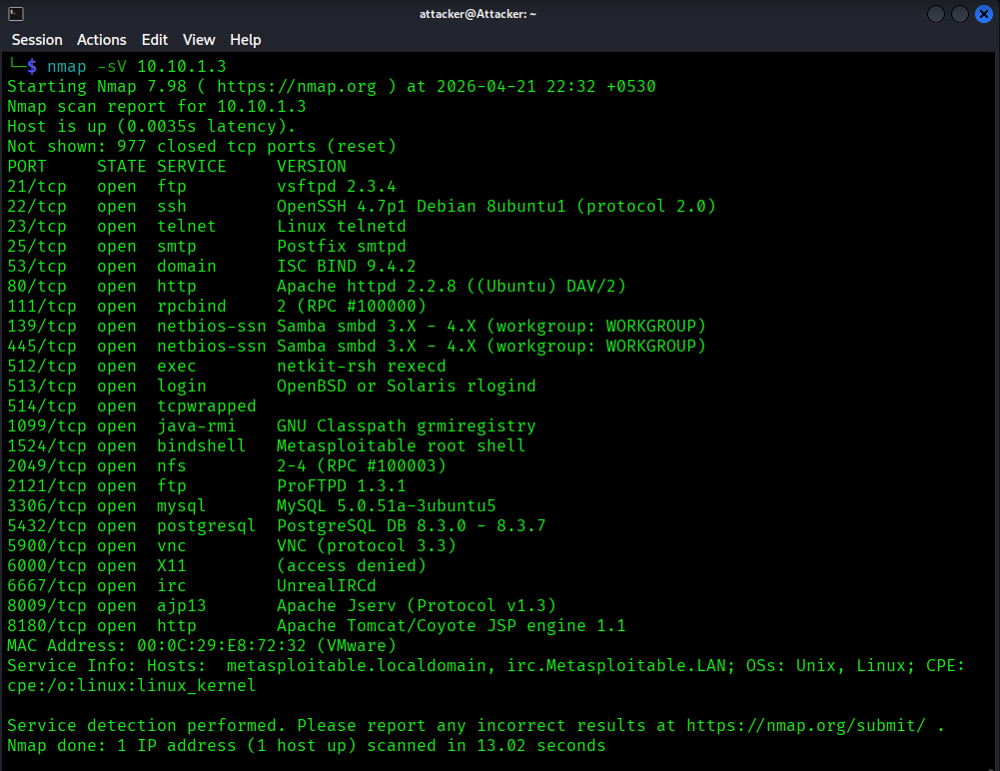
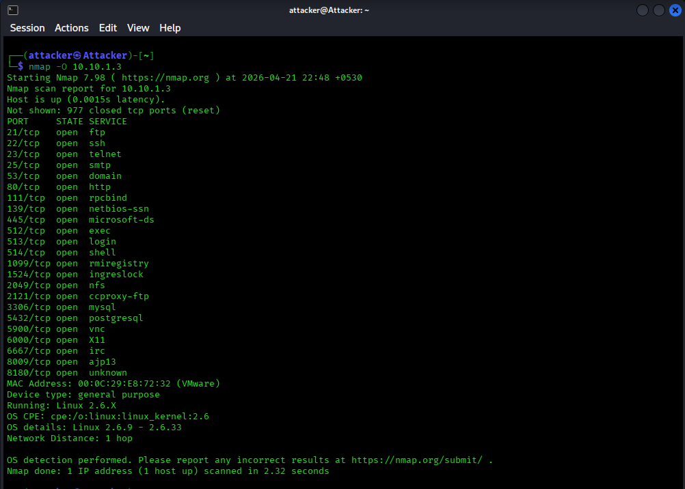
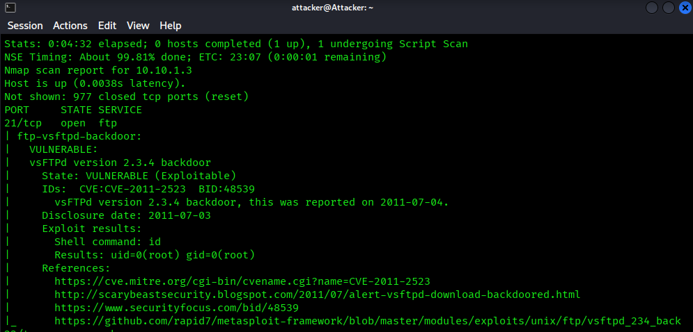

# 🔍 Nmap Network Recon Lab

Hands-on cybersecurity project demonstrating internal network scanning and vulnerability assessment using Nmap.
# 🔍 Nmap Network Reconnaissance & Vulnerability Lab

## 📌 Overview

This project demonstrates internal network scanning and vulnerability assessment using Nmap in a controlled lab environment.

The objective is to identify active hosts, open ports, running services, and potential vulnerabilities on a target system.

---

## 🏗️ Lab Setup

* **Attacker:** Kali Linux
* **Target:** Metasploitable2
* **Environment:** VMware Workstation
* **Network:** Host-Only Adapter

### IP Configuration:

* Kali Linux: 10.10.1.15
* Metasploitable2: 10.10.1.3

---

## ⚙️ Tools Used

* Nmap
* Kali Linux
* Metasploitable2
* VMware Workstation

---

## 🔎 Methodology

1. Host Discovery
2. Port Scanning
3. Service & Version Enumeration
4. OS Detection
5. Vulnerability Scanning

---

## 🚀 Execution

### 🔹 Step 1: Host Discovery

```bash
nmap -sn 10.10.1.0/24
```



---

### 🔹 Step 2: Port Scanning

```bash
nmap -sS 10.10.1.3
```



---

### 🔹 Step 3: Service & Version Enumeration

```bash
nmap -sV 10.10.1.3
```



---

### 🔹 Step 4: OS Detection

```bash
nmap -O 10.10.1.3
```



---

### 🔹 Step 5: Vulnerability Scanning

```bash
nmap --script vuln 10.10.1.3
```



---

## 📊 Key Findings

* Multiple open ports increase attack surface
* Insecure protocols like Telnet are exposed
* Critical services such as SMB and databases are accessible
* Vulnerabilities like FTP anonymous login and SQL injection were identified

---

## 🧠 Key Learning

* Learned host discovery using Nmap
* Identified open ports and services
* Understood service enumeration
* Performed vulnerability scanning using NSE

---

## ⚠️ Disclaimer

This project was conducted in a controlled lab environment using intentionally vulnerable systems. Do not perform scanning on unauthorized systems.

---

## 👨‍💻 Author

**Hamza Raza**
Aspiring Cybersecurity Professional 🚀

